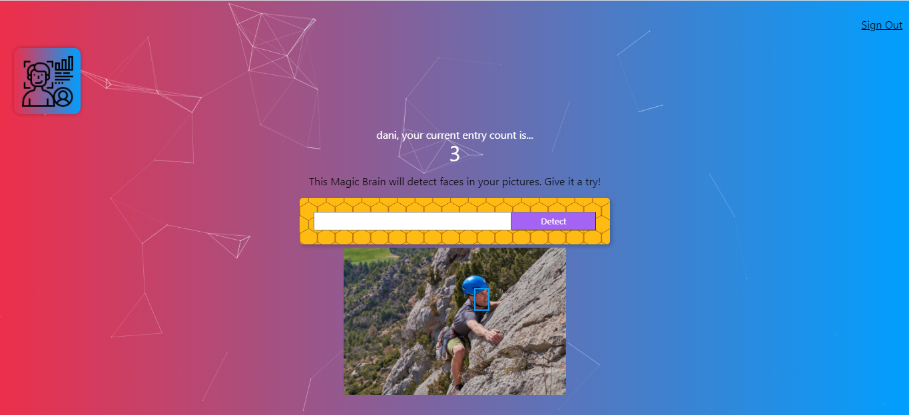

<p align="center">

</p>

# face-recognition-js
Welcome to Face-Recognition app.

## Built With

### Front-end

* [React](https://reactjs.org/)
* [Tachyons](https://tachyons.io/)

### Back-end

* [Javascript](https://www.javascript.com/)
* [Nodejs](https://nodejs.org/en/)
* [Express](https://expressjs.com/)
* [Bcrypt-nodejs](https://www.npmjs.com/package/bcrypt/)
* [Body-parser](https://www.npmjs.com/package/body-parser)
* [cors](https://www.npmjs.com/package/cors)
* [knex](https://www.npmjs.com/package/knex)
* [pg](https://www.npmjs.com/package/pg)

### Data Bases

* [PostgreSQL](https://www.postgresql.org/)

### API Face Recognition

* [Clarifai](https://www.clarifai.com/)

## What is Face Recognition?

A facial recognition system is a technology capable of identifying or verifying a person from a digital image or a video frame from a video source.

* [Facial recognition](https://en.wikipedia.org/wiki/Facial_recognition_system)

In this project I have created a full website with features including users register and log-in, number of images entries and a face recognition system using Clarifai API.

## Getting Started

### Prerequisites

For this project you need:

```
Nodejs
```

```
Clarifai API Key
```

### Installing

Go to face-recognition-js/server and run:

```
npm install
```

Add your API key to face-recognition-js/server/controllers/image.js and run the server.

```
nodemon index.js
```

Now you can go to face-recognition-js/client/face-recognition-js and install all the react dependencies:

```
npm install
```

## Running React

In the folder face-recognition-js/client/face-recognition-js run:

```
npm start
```

Now you can see the Face Recognition web!


## Result

### Navigation

* Sign In


* Log In


* Face Recognition



